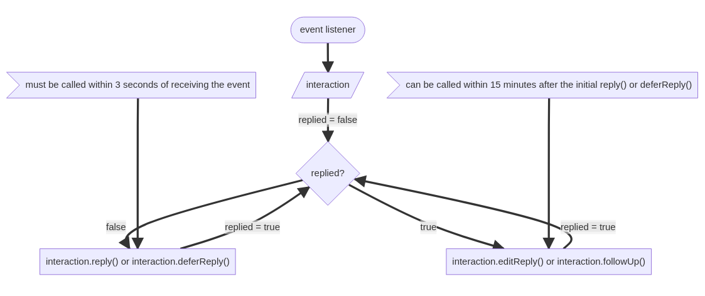
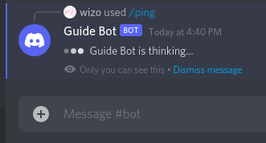

## Replying to slash commands

Once you've registered your slash commands, users can now use your slash commands! Our next step is to make our bot reply to those slash commands. Let's go back to the `index.js` file. Your `index.js` file should look like this:

:::: code-group
::: code-group-item index.js
```js {13-23}
const { Client, Intents } = require('discord.js');
const { token } = require('./config.json');

const client = new Client({ intents: [Intents.FLAGS.GUILDS] });

client.once('ready', () => {
	console.log('Ready!');
});

client.on('interactionCreate', async interaction => {
	if (!interaction.isCommand()) return;

	if (interaction.commandName === 'ping') {
		await interaction.reply('Pong!');
	} else if (interaction.commandName === 'server') {
		await interaction.reply(`Server name: ${interaction.guild.name}\nTotal members: ${interaction.guild.memberCount}`);
	} else if (interaction.commandName === 'user') {
		await interaction.reply(`Your tag: ${interaction.user.tag}\nYour id: ${interaction.user.id}`);
	}
});

client.login(token);
```
:::
::::

A slash command is just one type of interaction. Therefore, we should first check if the interaction is a slash command by calling `.isCommand()`. Next, we check the name of the command by accessing the `.commandName` property. Finally, we reply to the interaction by calling `.reply()`.

::: danger
You MUST reply to the interaction within **3 seconds** of receiving it.
:::

Let's start the bot:
```sh:no-line-numbers
node index.js
```
and then use the `/ping` command in your guild. You should see something like this:

<DiscordMessages>
	<DiscordMessage profile="bot">
		<template #interactions>
			<DiscordInteraction profile="user" :command="true">ping</DiscordInteraction>
		</template>
		Pong!
	</DiscordMessage>
</DiscordMessages>

Congratulations! 🎉

You now have 3 working slash commands. Go ahead and try out `/server` and `/user` as well. 

Your `/server` should look like this:

<DiscordMessages>
	<DiscordMessage profile="bot">
		<template #interactions>
			<DiscordInteraction profile="user" :command="true">server</DiscordInteraction>
		</template>
		Server name: Discord.js Guide
		<br />
		Total members: 2
	</DiscordMessage>
</DiscordMessages>

And your `/user` should look like this:

<DiscordMessages>
	<DiscordMessage profile="bot">
		<template #interactions>
			<DiscordInteraction profile="user" :command="true">user</DiscordInteraction>
		</template>
		Your tag: User#0001
		<br />
		Your id: 123456789012345678
	</DiscordMessage>
</DiscordMessages>

::: tip
We've only looked at `.reply()` to reply to the incoming `interaction`. There are other ways to reply to an interaction, which we will see in a later section called [Replying (continued)](#replying-continued).
:::


## Replying (continued)

Here's a flowchart to help you understand visually *which* methods are you allowed to use at any given time. Feel free to refer back to this flowchart as you read the rest of this section.



### Defer

As we saw in the [Replying to slash commands](#replying-to-slash-commands) section:

::: danger
You MUST reply to the interaction within **3 seconds** of receiving it.
:::

But what if our command takes more than 3 seconds to process before it can reply? To solve this, we can defer the interaction with `.deferReply()` within 3 seconds of receiving it. This is how it will look when you defer an interaction:

```js:no-line-numbers
await interaction.deferReply();
```


Now that the interaction has been deferred, we can proceed with whatever task we need to do that might take a long time to finish. As long as the task finishes before the 15 minutes window, we can edit the deferral to let the user know that the bot is done completing the task.

```js:no-line-numbers
await interaction.deferReply();
// do some task that takes a long time to finish
await interaction.editReply('i am done!');
```

::: tip
Technically speaking, you could call `.reply()` right away with a message like `"Processing. Please wait..."` and treat that as a deferral. It's up to you to choose between using `.reply()` or `.deferReply()` within the first 3 seconds of receiving the interaction.

The only technical difference between `.reply()` and `.deferReply()` is that, if you don't call `.editReply()` or `.followUp()` after `.deferReply()`, then Discord will display the message `<Bot name> is thinking...` for the entire 15 minutes window and then turn into an "**Interaction failed**" error message once the 15 minutes window has expired.
:::

### Edit

#### Edit a reply

After sending an initial reply or defer (which must be done within **3 seconds** of receiving the interaction), you will have a **15 minutes** window to edit the reply or send followup messages however many times you want. We will look at followup messages in the next section.

To edit the original reply, we simply call `.editReply()` **after** calling `.reply()`.

```js:no-line-numbers
await interaction.reply('Pong!');
```

<DiscordMessages>
	<DiscordMessage profile="bot">
		<template #interactions>
			<DiscordInteraction
				profile="user"
				:command="true"
			>ping</DiscordInteraction>
		</template>
		Pong!
	</DiscordMessage>
</DiscordMessages>

```js:no-line-numbers {2}
await interaction.reply('Pong!');
await interaction.editReply('Pong edited');
```

<DiscordMessages>
	<DiscordMessage profile="bot" :edited="true">
		<template #interactions>
			<DiscordInteraction
				profile="user"
				:command="true"
			>ping</DiscordInteraction>
		</template>
		Pong edited
	</DiscordMessage>
</DiscordMessages>


#### Edit a deferReply

You can also call `.editReply()` **after** calling `.deferReply()`.

```js:no-line-numbers
await interaction.deferReply();
```


```js:no-line-numbers {2}
await interaction.deferReply();
await interaction.editReply('the task has been completed');
```


### Followup

#### Followup a reply

We can send additional messages after the initial reply. Just like edits, followups also have a **15 minutes** window.

You can call `.followUp()` **after** calling `.reply()`.

```js:no-line-numbers
await interaction.reply('pong');
await interaction.followUp('pong again');
```


#### Followup a deferReply

You can also call `.followUp()` **after** calling `.deferReply()`. However, a followup to a deferral does **NOT** behave the same way as a followup to a reply. **The first followup will edit the deferral instead**. Additional messages will start from **the second followup**.

```js:no-line-numbers
await interaction.deferReply()
await interaction.followUp('this is the first followup')
await interaction.followUp('this is the second followup')
```


### Ephemeral state

You may not always want everyone who has access to the channel to see a slash command's response. Thankfully, Discord implemented a way to hide messages from everyone but the executor of the slash command. This type of message is called *ephemeral* and can be set by using `ephemeral: true`.

#### Ephemeral reply

```js:no-line-numbers
await interaction.reply({ content: 'Pong!', ephemeral: true });
```

<DiscordMessages>
	<DiscordMessage profile="bot">
		<template #interactions>
			<DiscordInteraction
				profile="user"
				:command="true"
				:ephemeral="true"
			>ping</DiscordInteraction>
		</template>
		Pong!
	</DiscordMessage>
</DiscordMessages>

#### Ephemeral defer

```js:no-line-numbers
await interaction.deferReply({ ephemeral: true });
```



#### Ephemeral edit

You **cannot** change the ephemeral state of a message that has been already sent. That means that if you do this:

```js:no-line-numbers
await interaction.reply({ content: 'pong', ephemeral: false });
await interaction.editReply({ content: 'pong edited', ephemeral: true });
```

The reply will **not** change from non-ephemeral to ephemeral, even though we called `.editReply()` with `ephemeral: true`.

<DiscordMessages>
	<DiscordMessage profile="bot">
		<template #interactions>
			<DiscordInteraction
				profile="user"
				:command="true"
        :ephemeral="false"
			>ping</DiscordInteraction>
		</template>
		Pong!
	</DiscordMessage>
</DiscordMessages>
<br />
<DiscordMessages>
	<DiscordMessage profile="bot" :edited="true">
		<template #interactions>
			<DiscordInteraction
				profile="user"
				:command="true"
			>ping</DiscordInteraction>
		</template>
		Pong edited
	</DiscordMessage>
</DiscordMessages>

---

The same applies to `.deferReply()` into `.editReply()`. 

The following **will stay non-ephemeral**.

```js:no-line-numbers
await interaction.deferReply({ ephemeral: false });
await interaction.editReply({ content: 'pong edited', ephemeral: true });
```

And the following **will stay ephemeral**.

```js:no-line-numbers
await interaction.deferReply({ ephemeral: true })
await interaction.editReply({ content: 'pong edited', ephemeral: false })
```

#### Ephemeral followup

The ephemeral state of followups are independent of the initial reply. This is because the followup is a separate message.

```js:no-line-numbers
await interaction.reply({ content: 'pong', ephemeral: false })
await interaction.followUp({ content: 'first followup', ephemeral: true })
await interaction.followUp({ content: 'second followup', ephemeral: true })
```


As we saw in the previous section about [followup a deferReply](#followup-a-deferreply), the first followup to a deferral will replace the deferral instead of sending a new message. As a result, this will also affect the ephemeral state of the first followup:

```js:no-line-numbers
await interaction.deferReply({ ephemeral: true })
await interaction.followUp({ content: 'first followup', ephemeral: false })
await interaction.followUp({ content: 'second followup', ephemeral: false })
```


### Fetching the reply after sending it

::: danger
You **cannot** fetch an ephemeral message.
:::

You might need the `Message` object of the reply for various reasons, such as adding reactions. You can use the [`CommandInteraction#fetchReply()`](https://discord.js.org/#/docs/main/stable/class/CommandInteraction?scrollTo=fetchReply) method to fetch the `Message` instance of the reply:

```js:no-line-numbers
await interaction.reply('Pong!');
const message = await interaction.fetchReply();

await message.react('🤔');
```

Another reason you might need the `Message` object of the reply, is to await message components (such as `Buttons`):

```js:no-line-numbers
await interaction.reply({ content: 'Pong!', components: [actionRow] });
const message = await interaction.fetchReply();

const filter = i => i.customId === 'someId' && i.user.id === interaction.user.id;
await message.awaitMessageComponent({ filter });
```

Refer to the [Buttons](./buttons.md) page for more information about how to build one.

Another way to fetch the reply is to provide a `fetchReply:true` to the `.reply()` method.

```js:no-line-numbers
const message = await interaction.reply({ content: 'Pong!', fetchReply: true });
```

### Deleting the reply after sending it

::: danger
You **cannot** delete an ephemeral message.
:::

You can also delete the reply after sending the reply.

```js:no-line-numbers
await interaction.reply('Pong!');
await interaction.deleteReply();
```
